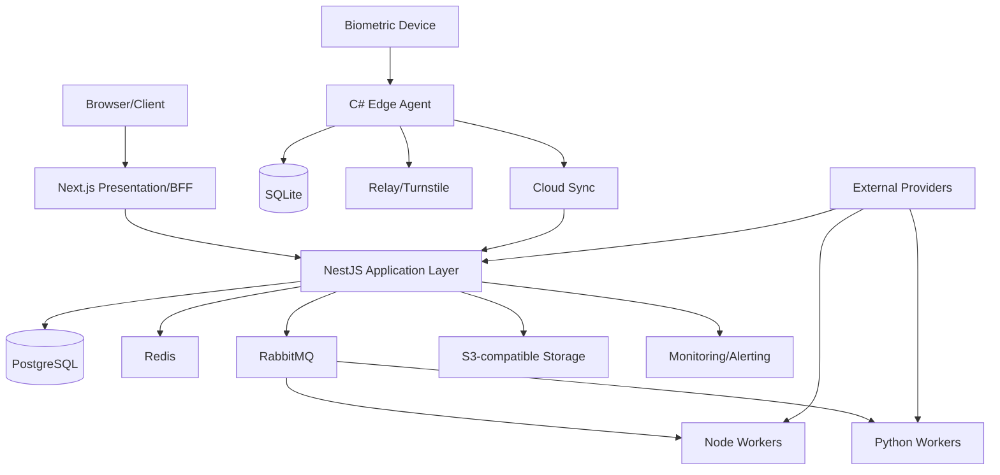
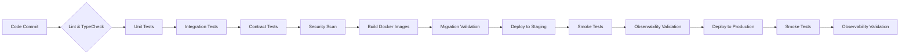

# Gym Management SaaS Architecture

## System Context


## Execution Zones

| Zone | Responsibilities |
|------|------------------|
| A. Browser/Client | Render UI, capture user input, display data, handle offline state for mobile |
| B. Next.js Presentation/BFF | Server-side rendering, API aggregation, authentication middleware, security headers, feature flags |
| C. NestJS Persistent Application Layer | Transactional business logic, API contracts, authorization, event publishing (Outbox), synchronous integrations |
| D. Python Specialized Worker Layer | Analytics, reporting, bulk processing, reconciliation, document processing, future ML workloads |
| E. Database/Cache/Event Infrastructure | PostgreSQL (OLTP source of truth), Redis (cache + coordination), RabbitMQ (durable messaging), S3 (object storage) |
| F. On-Premise Edge Layer | C#/.NET agent: device discovery, vendor adapters, local eligibility cache, access decisions, SQLite persistence, durable queue, cloud sync |
| G. External Provider Layer | Payment gateways, Meta WhatsApp, SMS/email providers, identity providers |
## Module Structure (NestJS Modular Monolith)

```
src/
├── tenancy/
├── identity/
├── members/
├── memberships/
├── finance/
├── crm/
├── pt/
├── scheduling/
├── attendance/
├── inventory/
├── workouts/
├── diet/
├── notifications/
├── reports/
└── shared/
    ├── database/
    ├── events/
    ├── security/
    └── validation/
```
## Architecture Decision Records (ADR)

| Decision | Alternative | Reason | Trade-off |
|----------|-------------|--------|-----------|
| Next.js as BFF + App Router | Pure SPA | SEO, initial load performance, data fetching optimization | Requires Node.js server |
| NestJS modular monolith | Microservices | Simpler deployment, transactions, development velocity; extract later | Requires discipline to maintain boundaries |
| PostgreSQL as primary DB | MongoDB/MySQL | Strong consistency, SQL for complex queries, proven at scale | Vertical scaling limits (mitigated by read replicas) |
| Redis for caching + coordination | Memcached | Pub/sub, rich data types, durability options | Slightly higher memory usage |
| RabbitMQ as broker | Kafka/Kinesis | Simpler operations, exactly-once semantics via transactions, language agnostic | Lower throughput than Kafka (sufficient for target load) |
| Outbox pattern | Transactional logs / CDC | Guarantees event publishing within DB transaction | Requires polling or change data capture |
| UUID primary keys | Auto-increment IDs | Distributed ID generation, merge-safe, no hot keys | Slightly larger indexes, less readable URLs |
| Organization/Branch ID tenancy | Separate schemas/databases | Simpler cross-tenant reporting, backup/restore | Operational overhead, schema migration complexity |
| RBAC with permissions | ABAC/ACL | Simpler to audit and manage, performs well | Less granular than attribute-based |
| C#/.NET for edge agent | Java/Python | Better Windows device integration, mature SDKs | Requires Windows expertise |
| REST as primary API | GraphQL | Simpler caching, better tooling, matches NestJS strengths | Over-fetching/under-fetching mitigated by specific endpoints |
| Financial ledger as append-only | Mutable balances | Auditability, compliance, reconciliation simplicity | Requires read models for derived values |
| Idempotency keys on all mutation APIs | Client-side deduplication | Guarantees exactly-once semantics despite retries | Requires server-side storage and validation |
| Separate OLTP and analytics workloads | HTAP database | Prevents analytic queries from impacting transactional performance | Requires ETL pipeline and storage duplication |
| OpenTelemetry for observability | Vendor-specific tools | Standardized, correlates traces/logs/metrics across services | Requires instrumentation discipline |
| Zero-downtime DB migrations | Downtime windows | Supports 24/7 availability, meets SLA | Requires backward/forward compatible schema changes |
## Failure Mode Matrix

| Scenario | Detection | Fallback | Retry | Recovery | Reconciliation |
|----------|-----------|----------|-------|----------|----------------|
| PostgreSQL outage | Health checks, circuit breaker | Read-only mode (cached data) | Exponential backoff | Failover to replica, promote | WAL replay, check consistency |
| Redis outage | Health checks, latency spikes | Cache-aside to DB (degraded perf) | Exponential backoff | Restart/replace node | Warm cache from DB |
| Message broker outage | Queue depth, consumer lag | Local queues (edge), DB polling (temporary) | Exponential backoff with DLQ | Cluster failback | Process DLQ, verify event ordering |
| Payment provider outage | Webhook timeout, API errors | Queue payments for later | Exponential backoff + manual review | Provider recovery | Reconcile ledger vs provider statements |
| WhatsApp outage | Message delivery failures | Fallback to SMS/email | Exponential backoff | Provider recovery | Notify users via alternative channels |
| Biometric device outage | Device health checks | Manual check-in (RFID/QR) | N/A | Device replacement/repair | Sync offline events when restored |
| Edge agent outage | Heartbeat failure | Local device fallback (if capable) | N/A | Restart agent | Sync queued events on recovery |
| Cloud outage (region) | Health checks, latency | Multi-region failover (active-passive) | N/A | DNS failover | Verify data consistency post-failover |
| Network partition | Timeout, health checks | Local operation with queued sync | Exponential backoff | Partition healing | Conflict resolution (last-write-wins or manual) |
| Duplicate webhook | Idempotency key conflict | Reject duplicate | N/A | N/A | Idempotency table prevents side effects |
| Duplicate attendance | Duplicate event detection | Discard after first | N/A | N/A | Unique constraint on (device_id, timestamp, member_id) |
| Lost acknowledgement | Missing ack after timeout | Redeliver from queue | Exponential backoff | N/A | Idempotency prevents double-processing |
| Worker crash | Heartbeat failure, queue backlog | Other workers pick up (competing consumers) | Automatic on restart | Restart worker | Reprocess unacknowledged messages |
| Partial synchronization | Sync cursor gaps | Resume from last successful | N/A | Manual intervention | Compare hashes, resolve discrepancies |
| Failed deployment | Health checks, smoke tests | Rollback to previous version | N/A | Fix and redeploy | Verify data integrity, run migrations |
## Scaling Model

**Assumptions:**
- 10,000 organizations
- Average 5 branches/organization
- 100M total members
- Peak attendance events: 50,000/sec
- Concurrent staff users: 200,000

**Estimates:**
- API QPS: 15,000 (read-heavy)
- Attendance events/sec: 50,000 (biometric check-ins)
- DB growth: 2 TB/month (attendance, transactions, audit logs)
- Cache size: 50 GB (hot member data, eligibility snapshots)
- Queue throughput: 100k msgs/sec (events, notifications)
- Object storage growth: 1 TB/month (documents, media)

**Bottlenecks & Mitigation:**
1. **Attendance ingestion** → Shard by device_id, use batch processing, edge pre-aggregation
2. **Database write scaling** → Read replicas for reads, consider partitioning attendance by org_id+date
3. **Queue consumer lag** → Increase worker concurrency, prioritize critical events (access control)
4. **Redis memory usage** → LRU eviction for non-critical caches, optimize key sizes
5. **Object storage costs** → Lifecycle policies, compression, multipart uploads

**Scaling Triggers (avoid premature optimization):**
- Consistent >70% CPU/RDS utilization for 15 min → Add read replica
- Attendance table > 10B rows → Partition by month + org hash
- Queue backlog > 5 min processing time → Scale worker pods
- Redis eviction rate > 1% → Increase memory or optimize caching strategy
- API P99 latency > 2s → Profile endpoints, add caching, optimize queries
## High Availability / Disaster Recovery

- **PostgreSQL:** Multi-AZ with synchronous streaming replica, automated failover, PITR via WAL archiving
- **Redis:** Redis Cluster with replica nodes, automatic failover
- **RabbitMQ:** Mirrored queues across nodes, automatic failover
- **S3:** Cross-region replication (CRR) for critical buckets
- **Deployment:** Blue-green or rolling updates with health checks
- **RPO:** ≤ 5 minutes (via WAL shipping and synchronous commit)
- **RTO:** ≤ 1 hour (including failover and validation)
- **Backup:** Daily full + hourly incrementals, monthly off-site, annual air-gapped
- **DR Procedure:** Failover to secondary region, validate data integrity, update DNS, monitor

## CI/CD Pipeline



**Zero-downtime DB Strategy:**
1. Deploy backward-compatible schema changes (additive only)
2. Deploy code that writes to both old and new schemas (dual-write)
3. Backfill historical data asynchronously
4. Switch reads to new schema
5. Remove dual-write and old schema

---

*Document Version: 1.0*
*Last Updated: 2026-09-01*