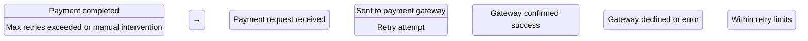
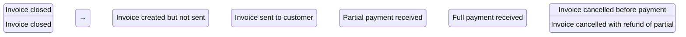
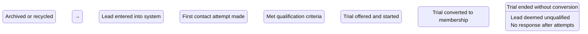
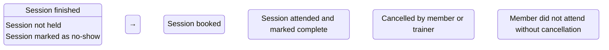
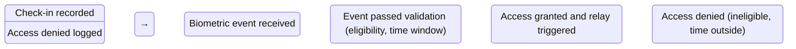
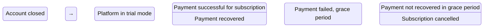

# Gym Management SaaS Domain Map

## Bounded Contexts

1. **Tenancy** - Manages organizations, branches, and multi-tenancy concerns
2. **Identity** - Handles users, roles, permissions, authentication
3. **Members** - Core member profile, identifiers, demographics
4. **Memberships** - Membership plans, subscriptions, pauses, renewals, cancellations
5. **Finance** - Invoices, payments, refunds, credit notes, tax, ledger
6. **CRM** - Leads, trials, follow-ups, conversion tracking
7. **PT/Training** - Personal training packages, sessions, trainer management
8. **Scheduling** - Group classes, batches, service appointments, waitlists
9. **Attendance** - Check-ins, access control, biometric events, attendance records
10. **Inventory** - Retail items, supplements, stock management
11. **Workouts** - Exercise libraries, workout plans, progress tracking
12. **Diet** - Meal plans, nutrition tracking, dietary preferences
13. **Notifications** - Template management, channel delivery, tracking
14. **Reports** - Operational and analytical reporting
15. **Edge Sync** - Offline synchronization, device eligibility, access decisions
## Context Map

```mermaid
graph TD
    Tenancy -->|Provides tenant context| Identity
    Tenancy -->|Scopes all data| Members
    Tenancy -->|Scopes all data| Memberships
    Tenancy -->|Scopes all data| Finance
    Tenancy -->|Scopes all data| CRM
    Tenancy -->|Scopes all data| PT
    Tenancy -->|Scopes all data| Scheduling
    Tenancy -->|Scopes all data| Attendance
    Tenancy -->|Scopes all data| Inventory
    Tenancy -->|Scopes all data| Workouts
    Tenancy -->|Scopes all data| Diet
    Tenancy -->|Scopes all data| Notifications
    Tenancy -->|Scopes all data| Reports
    Tenancy -->|Scopes| Edge Sync
    
    Identity -->|Provides authz| Members
    Identity -->|Provides authz| Memberships
    Identity -->|Provides authz| Finance
    Identity -->|Provides authz| CRM
    Identity -->|Provides authz| PT
    Identity -->|Provides authz| Scheduling
    Identity -->|Provides authz| Attendance
    Identity -->|Provides authz| Inventory
    Identity -->|Provides authz| Workouts
    Identity -->|Provides authz| Diet
    Identity -->|Provides authz| Notifications
    Identity -->|Provides authz| Reports
    
    Members -->|Has many| Memberships
    Members -->|Has many| PT
    Members -->|Has many| Attendance
    Members -->|Has many| Workouts
    Members -->|Has many| Diet
    Members -->|Has many| Inventory (purchases)
    
    Memberships -->|Generates| Finance
    Finance -->|Records| CRM (as transactions)
    
    CRM -->|Feeds into| Members (as leads)
    CRM -->|Uses| Scheduling (for trials)
    
    PT -->|Uses| Scheduling (for session booking)
    PT -->|Creates| Workouts (as assignments)
    
    Scheduling -->|Generates| Attendance (class check-ins)
    Scheduling -->|Manages| Inventory (class supplies)
    
    Attendance -->|Updates| Members (last visit, streak)
    Attendance -->|Feeds| Finance (for add-on charges)
    
    Workouts -->|Consumed by| Members
    Diet -->|Consumed by| Members
    
    Notifications -->|Triggered by| Members (events)
    Notifications -->|Triggered by| Memberships (expiry, renewal)
    Notifications -->|Triggered by| Finance (payment status)
    Notifications -->|Triggered by| Attendance (check-in/out)
    Notifications -->|Triggered by| CRM (lead follow-up)
    
    Reports -->|Reads from| All contexts (read replicas)
    Edge Sync -->|Syncs| Attendance (offline events)
    Edge Sync -->|Syncs| Members (eligibility snapshots)
    Edge Sync -->|Provides| Identity (device credentials)
```
## Module Ownership Matrix

| Context | Owner Module | Tables Owned | Events Published |
|---------|--------------|--------------|------------------|
| Tenancy | tenancy | organizations, branches, tenant_settings | TenantCreated, BranchAdded, TenantConfigurationUpdated |
| Identity | identity | users, roles, permissions, auth_tokens, mfa_secrets | UserCreated, RoleAssigned, PermissionGranted, UserLoggedIn, MfaEnrolled |
| Members | members | members, member_identifiers, member_profiles, member_consents | MemberCreated, MemberUpdated, MemberDeactivated, MemberConsentGiven |
| Memberships | memberships | membership_plans, memberships, membership_pauses, membership_extensions, membership_cancellations, membership_transfers, membership_discounts | MembershipStarted, MembershipRenewed, MembershipPaused, MembershipExtended, MembershipCancelled, MembershipTransferred, MembershipDiscountApplied |
| Finance | finance | invoices, invoice_items, payments, payment_allocations, refunds, credit_notes, tax_lines, financial_ledger | InvoiceCreated, PaymentSucceeded, PaymentFailed, RefundIssued, CreditNoteIssued, FinancialLedgerUpdated |
| CRM | crm | leads, lead_sources, lead_stages, lead_activities, follow_ups, trials, visits, conversions | LeadCreated, LeadContacted, LeadQualified, TrialStarted, VisitCompleted, MemberConverted, LeadLost |
| PT | pt | trainers, trainer_availability, pt_packages, pt_enrollments, pt_sessions, trainer_bookings, trainer_commissions, workout_plans, exercises, workout_assignments, workout_progress | TrainerCreated, TrainerAvailabilityUpdated, PTPackagePurchased, PTEnrollmentCreated, PTSessionBooked, PTSessionCompleted, TrainerCommissionEarned |
| Scheduling | scheduling | batches, batch_schedules, services, service_schedules, member_batch_enrollments, member_service_bookings, waitlists, class_capacity | BatchCreated, BatchSchedulePublished, ServiceCreated, ServiceSchedulePublished, MemberEnrolledInBatch, WaitlistJoined, WaitlistConverted, CapacityUpdated |
| Attendance | attendance | attendance_events, attendance_records, access_decisions, device_mappings, eligibility_snapshots | AttendanceEventRecorded, AttendanceRecorded, AccessGranted, AccessDenied, EligibilitySnapshotUpdated |
| Inventory | inventory | inventory_items, inventory_transactions, inventory_lots, suppliers, purchase_orders | InventoryItemCreated, InventoryStockUpdated, InventoryItemSold, PurchaseOrderReceived |
| Workouts | workouts | workout_templates, workout_exercises, workout_sessions, exercise_libraries | WorkoutPlanAssigned, WorkoutSessionLogged, ExerciseLibraryUpdated |
| Diet | diet | diet_plans, meal_templates, nutrition_logs, dietary_preferences | DietPlanAssigned, MealTemplateUsed, NutritionLogRecorded |
| Notifications | notifications | notification_policies, notification_templates, notification_attempts, notification_deliveries, notification_channels | NotificationSent, NotificationDeliveryFailed, NotificationChannelUpdated |
| Reports | reports | report_schemas, materialized_views, report_cache | No domain events (read-only context) |
| Edge Sync | edge-agent | device_registry, device_credentials, sync_cursors, offline_events, sync_conflicts | DeviceRegistered, CredentialIssued, SyncCompleted, SyncConflictDetected, EligibilitySnapshotDistributed |
## Member 360 Information Architecture

### Header (Immediate)
- Member identity (photo, name, member_id)
- Membership status (active, expired, on hold)
- Access status (granted/denied today)
- Quick actions (check-in, renew membership, book PT)

### Tabs/Sections

| Section | Load Type | Description |
|---------|-----------|-------------|
| Memberships | Immediate | Current and historical memberships |
| Services | Immediate | Active service subscriptions (classes, facilities) |
| PT | Lazy | Personal training enrollments, session history, assignments |
| Biometric | Lazy | Biometric enrollment status, template data (hashed) |
| Orders | Lazy | Retail and service purchase history |
| Measurements | On-demand | Body measurements, progress charts |
| Attendance | Lazy (paginated) | Check-in history, streaks, visit frequency |
| Workout | Lazy | Assigned workouts, completion logs, progress |
| Follow-up | Lazy | Trainer follow-ups, goals, notes |
| Points | Loyalty | Points balance, transaction history, redemption |
| Medical History | On-demand (sensitive) | Allergies, conditions, physician notes, emergency contacts |
| Transactions | Lazy | Financial transaction history (payments, refunds) |
| Diet Plan | Lazy | Assigned meal plans, nutrition tracking |
| Attachments | On-demand | Consent forms, medical documents, signed agreements |
| Batches | Lazy | Enrolled batches/classes, schedule, attendance |
| Consent Forms | Lazy | Signed consent forms, status, expiry dates |
## Sitemap

| Module | Screens | Actions | Permissions | Primary Entities | Background Jobs | Audit Events |
|--------|---------|---------|-------------|------------------|-----------------|--------------|
| Dashboard | Overview, Analytics | Filter, Date range | ViewDashboard | None | None | DashboardAccessed |
| Members | List, Profile, Create, Edit | Search, Filter, Export | MemberView, MemberCreate, MemberEdit, MemberDelete | Member | MemberDataExport, MembershipExpiryChecker | MemberCreated, MemberUpdated, MemberDeleted |
| Memberships | Plans List, Membership Details, Renew, Pause, Cancel | Renew, Pause, Cancel, Transfer | MembershipView, MembershipRenew, MembershipPause, MembershipCancel | MembershipPlan, Membership | MembershipRenewalProcessor, PaymentRetryWorker | MembershipStarted, MembershipRenewed, MembershipPaused |
| Finance | Invoices, Payments, Refunds, Ledger | Create Invoice, Record Payment, Issue Refund | FinanceView, FinanceCreate, FinanceApprove | Invoice, Payment, PaymentAllocation | RevenueRecognition, TaxCalculationWorker | InvoiceCreated, PaymentSucceeded, RefundIssued |
| CRM | Leads List, Lead Detail, Convert, Follow Up | Create Lead, Contact, Qualify, Convert | CRMView, CRMCreate, CMREdit | Lead, LeadActivity, FollowUp | LeadNurturing, FollowUpScheduler | LeadCreated, LeadContacted, LeadQualified, MemberConverted |
| PT | Trainers List, Packages, Sessions, Bookings | Create Package, Book Session, Cancel Session | PTView, PTCREATE, PTEDIT | Trainer, PTPackage, PTEnrollment, PTSession | SessionReminder, CommissionCalculation | PTPackagePurchased, PTSessionBooked, PTSessionCompleted |
| Scheduling | Batches List, Batch Detail, Services, Calendar | Create Batch, Enroll Member, Manage Waitlist | ScheduleView, ScheduleCreate, ScheduleEdit | Batch, BatchSchedule, ServiceSchedule, Waitlist | CapacityMonitor, WaitlistProcessor | BatchCreated, MemberEnrolledInBatch, WaitlistJoined |
| Attendance | Check-in Log, Device Management, Access Reports | Manual Check-in, Device Sync, Access Report | AttendanceView, AttendanceManage | AttendanceEvent, AttendanceRecord, AccessDecision | EligibilitySync, DuplicateAttendanceDetector | AttendanceEventRecorded, AccessGranted, AccessDenied |
| Inventory | Items List, Stock Levels, Transactions | Add Item, Adjust Stock, Create PO | InventoryView, InventoryManage | InventoryItem, InventoryLot, PurchaseOrder | StockReorder, ExpiryChecker | InventoryItemCreated, InventoryStockUpdated |
| Workouts | Plans Library, Assignments, Logs | Create Plan, Assign Plan, Log Workout | WorkoutView, WorkoutManage | WorkoutTemplate, WorkoutAssignment, WorkoutSession | WorkoutRecommender | WorkoutPlanAssigned, WorkoutSessionLogged |
| Diet | Plans Library, Assignments, Logs | Create Plan, Assign Plan, Log Meal | DietView, DietManage | DietTemplate, MealTemplate, NutritionLog | NutritionAnalyzer | DietPlanAssigned, MealTemplateUsed |
| Notifications | Templates List, Attempts, Delivery Reports | Create Template, Send Test, View Logs | NotificationView, NotificationManage | NotificationPolicy, NotificationTemplate, NotificationAttempt | NotificationRetry, ChannelHealthMonitor | NotificationSent, NotificationDeliveryFailed |
| Reports | Report Builder, Scheduled Reports, Dashboard | Generate Report, Schedule Export | ReportsView, ReportsManage | ReportSchema, MaterializedView | ReportGeneration, DataExportJob | ReportGenerated, ReportScheduled |
| Edge Sync | Device Registry, Sync Status, Conflict Resolution | Register Device, Force Sync, Resolve Conflict | EdgeView, EdgeManage | DeviceRegistry, DeviceCredential, SyncCursor, OfflineEvent | SyncScheduler, ConflictResolver | DeviceRegistered, SyncCompleted, SyncConflictDetected |
## State Machines

### Membership

```mermaid
stateDiagram-v2
    [*] → Inactive: Membership created but not started
    Inactive → PendingPayment: Payment initiated
    PendingPayment → Active: Payment succeeded
    Active → OnHold: Membership paused
    OnHold → Active: Pause ended
    Active → Cancelling: Cancellation requested
    Cancelling → Cancelled: Cancellation processed
    Active → Expired: End date reached without renewal
    Expired → Renewing: Renewal initiated
    Renewing → Active: Renewal succeeded
    Expired → [*]: Grace period ended without renewal
    Cancelled → [*]: After grace period
```


### Payment


### Invoice


### Lead


### PT Session


### Attendance


### SaaS Subscription (for platform)


### Device Sync (Edge Agent)

```mermaid
stateDiagram-v2
    [*] → Idle: Waiting for events or sync trigger
    Idle → Collecting: Collecting biometric events from device
    Collecting → Validating: Validating events locally (eligibility, duplicates)
    Validating → Encrypting: Encrypting batch for secure transport
    Encrypting → Uploading: Uploading batch to cloud
    Uploading → SyncSuccess: Acknowledgement received from cloud
    Uploading → SyncFailed: Upload failed, will retry
    SyncSuccess → [*]: Events marked as synced locally
    SyncFailed → Idle: After retry delay, back to idle
```

## Risks and Mitigations

| Risk | Likelihood | Impact | Mitigation |
|------|------------|--------|------------|
| Context boundary violations | Medium | High | Enforce via code ownership, API contracts, automated architecture tests |
| Event schema drift | Low | Medium | Schema registry, versioning, consumer compatibility checks |
| Tenancy leakage | Low | High | Automated security scanning, database row-level security, access log auditing |
| Circular dependencies between contexts | Medium | Medium | Dependency inversion, shared kernel only for immutable contracts, strict layering |
| Inconsistent ubiquituous language | Low | Low | Domain-driven design workshops, ubiquitous language glossary, code reviews |